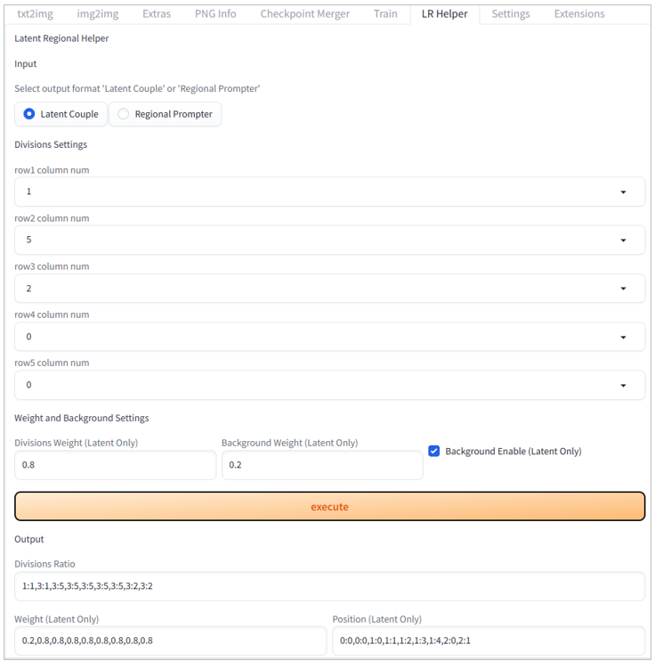
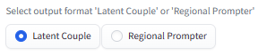
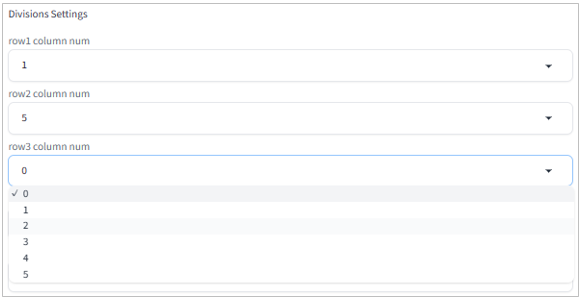
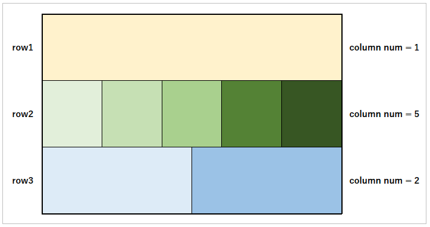
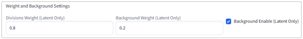
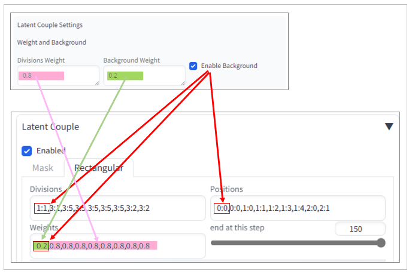
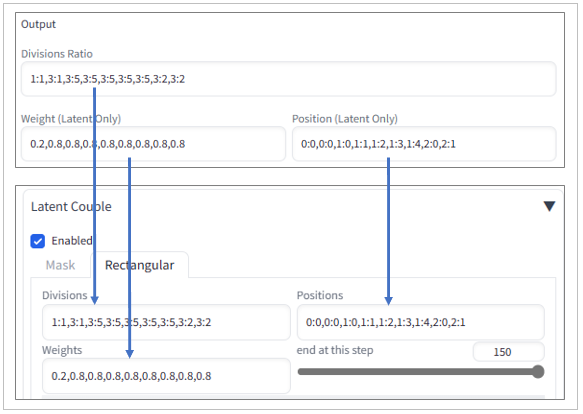
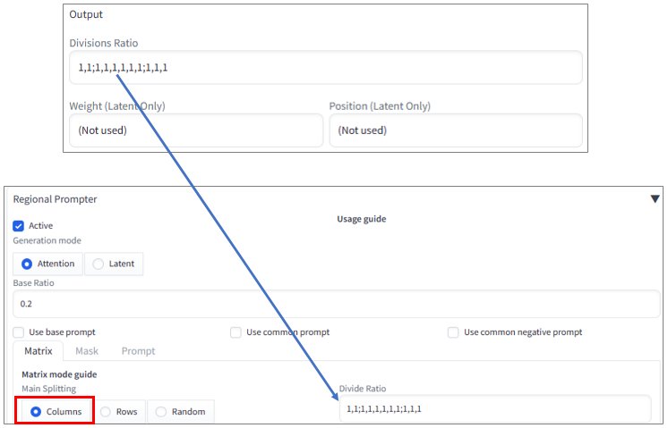

# sd-webui-latent-regional-helper

[English(英語)](./README.md) | [Japanese(日本語)](./README_jp.md)

## Table of Contents

- [sd-webui-latent-regional-helper](#sd-webui-latent-regional-helper)
  - [Table of Contents](#table-of-contents)
  - [Overview](#overview)
  - [Installation](#installation)
  - [Usage](#usage)
  - [Links](#links)
  - [License](#license)
  - [Conclusion](#conclusion)

## Overview

`Stable Diffusion Web UI` is an AI tool that can generate images from text and modify existing images by adding text. It includes two extensions called `Latent Couple` and `Regional Prompter`. These extensions allow you to divide an image into multiple regions and apply different text (prompts) to each region, enabling more flexible image generation and modification.

While this feature greatly expands the possibilities of image generation, configuring the region division can be challenging and often causes confusion. To simplify the region division settings, I created an extension called `Latent Regional Helper`. This extension allows you to easily output the configuration values for region division by selecting the number of columns for each row from a dropdown list.

`Latent Regional Helper` is a small program that will assist you with region division and free you from the confusion.

## Installation

1. Launch the WebUI.
2. Open the `Extensions` tab.
3. Open the `Install from URL` tab.
4. Enter the following URL in the `URL for extension's git repository` text box:  
<https://github.com/safubuki/sd-webui-latent-regional-helper.git>
5. Click the `Install` button.
6. After the installation is complete, open the `Installed` tab.
7. Click the `Apply and restart UI` button to restart the WebUI.

## Usage

Here is how to use `Latent Regional Helper`:

1. Open the Extensions tab.
     - Open the `LR Helper` tab.
2. Select the output format.
     - Choose either `Latent Couple` or `Regional Prompter`.
     
3. Configure the region division.
     - Set the number of columns for each row from `row1 column num` to `row5 column num`.
     
     - NOTE:
         - Rows with a column number of 0 will be skipped.
         - If there is a row with a column number of 0 between rows with configured column numbers, that row will be skipped and the rows will be compacted.
         - Up to a maximum of 5 rows and 5 columns can be divided.
     - If you want to configure it as follows:
     
     Set the `Divisions Settings` as follows:
         - `row1 column num` = 1
         - `row2 column num` = 5
         - `row3 column num` = 2
         - `row4 column num` = 0
         - `row5 column num` = 0
4. Configure the weight and background.
     - If you selected `Latent Couple` in step 2, you can also configure the weight and background.
     
     - Divisions Weight:
         - Set the base weight for the divided regions in `Divisions Weight`.
     - Background Weight and Enable setting:
         - Set the weight for the background in `Background Weight`.
         - Check the Background Enable box.
     - These settings will be used in the following section of `Latent Couple`.
     
5. Execute.
     - Once all input settings are complete, click the `execute` button.
     - The result will be output in the Output text box.
6. Using the output result.
     - For Latent Couple:
         - Manually copy and paste the output result into `Latent Couple`.
     
     - For Regional Prompter:
         - Manually copy and paste the output result into `Regional Prompter`.
     
         - Do not use `Position` and `Weight`.
         - Set `Columns` for the `Main Splitting` setting in `Regional Prompter`.
7. From here, continue your work with `Latent Couple` or `Regional Prompter`.

## Links

- Latent Couple (original)  
<https://github.com/opparco/stable-diffusion-webui-two-shot>
- Latent Couple (forked)  
<https://github.com/ashen-sensored/stable-diffusion-webui-two-shot>
- Regional Prompter (original)  
<https://github.com/hako-mikan/sd-webui-regional-prompter>

## License

Please refer to the license file for details.  
[Go to LICENSE file](./LICENSE)

## Conclusion

If you have any issues or requests, please contact me through the issue tracker.
