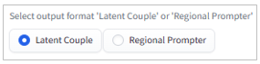
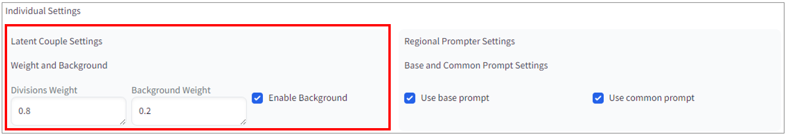
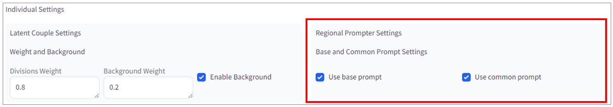
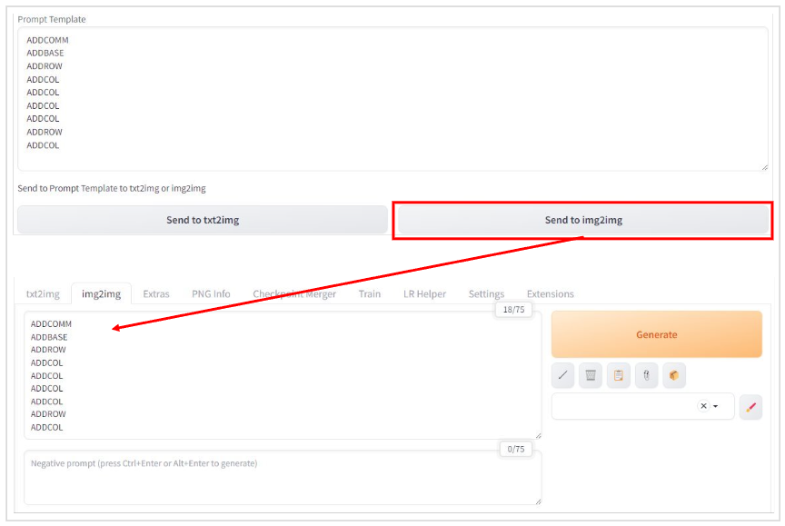

# sd-webui-latent-regional-helper

[English(英語)](./README.md) | [Japanese(日本語)](./README_jp.md)

## Table of Contents

- [sd-webui-latent-regional-helper](#sd-webui-latent-regional-helper)
  - [Table of Contents](#table-of-contents)
  - [Release Notes](#release-notes)
  - [Overview](#overview)
  - [Installation](#installation)
  - [Usage](#usage)
    - [Common Setting](#common-setting)
    - [Individual Settings and Output Utilization](#individual-settings-and-output-utilization)
      - [For Latent Couple](#for-latent-couple)
      - [For Regional Prompter](#for-regional-prompter)
  - [Links](#links)
  - [License](#license)
  - [Conclusion](#conclusion)

## Release Notes

- 2024/02/13
  - Design changes
  - Added functionality to output prompt templates
  - Added functionality to send prompt templates to txt2img or img2img

## Overview

`Stable Diffusion Web UI` is an AI tool that can generate images from text and modify existing images by adding text. It includes two extensions called `Latent Couple` and `Regional Prompter`. These extensions allow you to divide an image into multiple regions and apply different text (prompts) to each region, enabling more flexible image generation and modification.

While this feature greatly expands the possibilities of image generation, configuring the region division can be challenging and often causes confusion. To simplify the region division settings, I created an extension called `Latent Regional Helper`. This extension allows you to easily output the configuration values for region division by selecting the number of columns for each row from a dropdown list.

`Latent Regional Helper` is a small program that will assist you with region division and free you from the confusion.  
  

## Installation

1. Launch the WebUI.
2. Open the `Extensions` tab.
3. Open the `Install from URL` tab.
4. Enter the following URL in the `URL for extension's git repository` text box:  
<https://github.com/safubuki/sd-webui-latent-regional-helper.git>
5. Click the `Install` button.
6. After the installation is complete, open the `Installed` tab.
7. Click the `Apply and restart UI` button to restart the WebUI.

## Usage

Here is how to use `Latent Regional Helper`:

### Common Setting

1. Open the Extensions tab.
     - Open the `LR Helper` tab.
2. Select the output format.
     - Choose either `Latent Couple` or `Regional Prompter`.  
     
3. Configure the region division.
     - Set the number of columns for each row from `row1 column num` to `row5 column num`.  
       
     - NOTE:
         - Rows with a column number of 0 will be skipped.
         - If there is a row with a column number of 0 between rows with configured column numbers, that row will be skipped and the rows will be compacted.
         - Up to a maximum of 5 rows and 5 columns can be divided.
     - If you want to configure it as follows:  
       
     Set the `Divisions Settings` as follows:
         - `row1 column num` = 1
         - `row2 column num` = 5
         - `row3 column num` = 2
         - `row4 column num` = 0
         - `row5 column num` = 0

### Individual Settings and Output Utilization

#### For Latent Couple

1. Weight and Background Settings
   - If you select `Latent Couple` in the common settings, you can configure the following settings:
   
      - Divisions Weight
        - Set the weight for the divided regions in the `Divisions Weight` field.
      - Background Weight and Enable setting
        - Set the weight for the background in the `Background Weight` field.
        - Check the `Background Enable` checkbox.
      - These settings will be used in the following section of `Latent Couple`:
      
      The `Enable Background` setting is also used in the Prompt Template mentioned below.

2. Execution
   - Once all input settings are done, click the `execute` button.
   - The result will be output in the text box under Output.

3. Utilizing the Output
   - Manually copy and paste the output of the division settings to `Latent Couple`.
   
   - Clicking the `Send to txt2img` or `Send to img2img` button will copy the Prompt Template to the prompt area of `txt2img` or `img2img`.
   

#### For Regional Prompter

1. Base and Common Prompt Settings
   - If you select `Regional Prompter` in the common settings, you can configure the following settings:
   
      - Base and Common Prompt Settings
        - Checking these options will output `ADDBASE` and `ADDCOMM` in the `Prompt Template` of the Output.
        Note that these checkboxes do not affect the output of the division settings.

2. Execution
   - Once all input settings are done, click the `execute` button.
   - The result will be output in the text box under Output.

3. Utilizing the Output
   - Manually copy and paste the output of the division settings to `Regional Prompter`.
   
      - `Position` and `Weight` are not used.
      - Select `Columns` for the `Main Splitting` setting in `Regional Prompter`.
   - Clicking the `Send to txt2img` or `Send to img2img` button will copy the Prompt Template to the prompt area of `txt2img` or `img2img`.
   
4. Continue working with either `Latent Couple` or `Regional Prompter`.

## Links

- Latent Couple (original)  
<https://github.com/opparco/stable-diffusion-webui-two-shot>
- Latent Couple (forked)  
<https://github.com/ashen-sensored/stable-diffusion-webui-two-shot>
- Regional Prompter (original)  
<https://github.com/hako-mikan/sd-webui-regional-prompter>

## License

Please refer to the license file for details.  
[Go to LICENSE file](./LICENSE)

## Conclusion

If you have any issues or requests, please contact me through the issue tracker.
