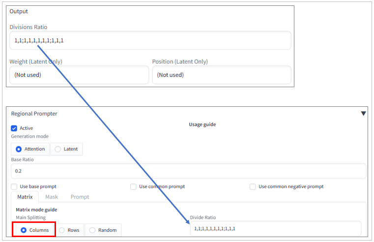

# sd-webui-latent-regional-helper

[English(英語)](./README.md) | [Japanese(日本語)](./README_jp.md)

## 目次

- [sd-webui-latent-regional-helper](#sd-webui-latent-regional-helper)
  - [目次](#目次)
  - [リリースノート](#リリースノート)
  - [概要](#概要)
  - [インストール方法](#インストール方法)
  - [使い方](#使い方)
    - [共通設定](#共通設定)
    - [個別設定と出力結果の利用](#個別設定と出力結果の利用)
      - [Latent Coupleの場合](#latent-coupleの場合)
      - [Regional Prompterの場合](#regional-prompterの場合)
  - [リンク](#リンク)
  - [ライセンス](#ライセンス)
  - [最後に](#最後に)

## リリースノート
- 2024/02/13
  - デザインの変更
  - プロンプトのテンプレートを出力する機能を追加
  - プロンプトのテンプレートをtxt2img、またはimg2imgに送信する機能を追加

## 概要

`Stable Diffusion Web UI`は、テキストから画像を生成したり、既存の画像にテキストを加えて変化させたりできるAIツールです。そして、このツールには`Latent Couple`と`Regional Prompter`という2つの拡張機能があります。これらは、画像を複数の領域に分割して、それぞれの領域に異なるテキスト（プロンプト）を適用することで、より自由に画像を生成し変化させる機能を持ちます。  

画像生成の可能性を広げる非常に便利な機能ですが、領域分割のための設定が難しく、私はしばしば頭を悩ませていました。そこで私は、領域分割の設定を簡単にするために`Latent Regional Helper`という拡張機能を作成しました。この拡張機能は、各行の列の数をドロップダウンリストから選択するだけで、領域分割のための設定値を出力することができます。  

`Latent Regional Helper`は、とても小さいプログラムですが、あなたの領域分割の助けとなり、悩みから解放するでしょう。

## インストール方法

1. WebUIを起動
2. `Extensions`タブを開く
3. `Install from URL`タブを開く
4. `URL for extension's git repository` テキストボックスに  
<https://github.com/safubuki/sd-webui-latent-regional-helper.git>  
を入力
5. `Install`ボタンをクリック
6. インストールが完了したら、`Installed`タブを開く
7. `Apply and restart UI`ボタンをクリックしてWebUIを再起動

## 使い方

以下に`Latent Regional Helper`の使い方を示す。

### 共通設定

1. 拡張機能のタブを開く
    - `LR Helper`タブを開く
2. 出力フォーマットを選択  
    - `Latent Couple` か `Regional Prompter` のどちらか一方を選択する  
    
3. 領域分割を設定
    - `row1 column num`から`row5 column num`にそれぞれ列数を設定する  
      
    - NOTE:
      - 列数が０の行は、スキップする
      - 列数が設定されている行の間に、列数が0の行がある場合、その行はスキップされて、行の間を詰める  
      - 最大で5(行)×5(列)の分割が可能
    - もし、次のように設定したい場合  
      
    `Divisions Settings`は次のように設定する  
      - `row1 column num` = 1
      - `row2 column num` = 5
      - `row3 column num` = 2
      - `row4 column num` = 0
      - `row5 column num` = 0

### 個別設定と出力結果の利用

#### Latent Coupleの場合

1. Weightと背景の設定
   - 共通設定で`Latent Couple`を選択した場合、次の設定ができる
   
      - Divisions Weight  
        - `Divisions Weight`に分割領域のベースとなるweightを設定  
      - Background Weight and Enable setting
        - `Background Weight`に背景のweightを設定
        - Background Enableにチェックを入れる
      - 設定は、`Latent Couple`の次の箇所に利用される  
        
      Enable Backgroundは、後述のPrompt Templeteにも利用する

2. 実行
   - 全てのInput設定が済んだら`execute`ボタンをクリック  
   - Outputのテキストボックスに結果が出力される  

3. 出力結果の利用
   - 分割設定の出力結果は、手動で`Latent Couple`にコピー＆ペースト  
     
   - Prompt Templateは、`Send to txt2img`または`Send to img2img`ボタンをクリックすると、`txt2img` `img2img`のプロンプトエリアにコピーできる
   

#### Regional Prompterの場合

1. Base and Common プロンプト設定
   - 共通設定で`Regional Prompter`を選択した場合、次の設定ができる
   
      - Base and Common Prompt Settings
        - それぞれ、チェックを入れるとOutputの`Prompt Template`に`ADDBASE` `ADDCOMM`が出力される  
        なお、このチェックは分割設定の出力には影響を与えない

2. 実行
    - 全てのInput設定が済んだら`execute`ボタンをクリック  
    - Outputのテキストボックスに結果が出力される  

3. 出力結果の利用
   - 分割設定の出力結果は、手動で`Regional Prompter`にコピー＆ペースト  
     
      - `Position`と`Weight`は使用しない
      - `Regional Prompter`の`Main Splitting`設定は`Columns`を選択すること
   - Prompt Templateは、`Send to txt2img`または`Send to img2img`ボタンをクリックすると、`txt2img` `img2img`のプロンプトエリアにコピーできる
   
4. 以降は、`Latent Couple`または`Regional Prompter`で作業を進める

## リンク

- Latent Couple (original)  
<https://github.com/opparco/stable-diffusion-webui-two-shot>
- Latent Couple (forked)  
<https://github.com/ashen-sensored/stable-diffusion-webui-two-shot>
- Regional Prompter（original）  
<https://github.com/hako-mikan/sd-webui-regional-prompter>

## ライセンス

ライセンスファイルを参照のこと  
[LICENSEファイルへ](./LICENSE)

## 最後に

もし問題、要望などありましたら、issueでご連絡ください。
